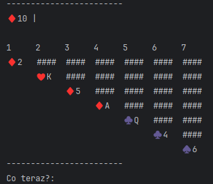
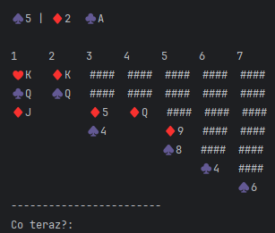

# Pasjans w Pythonie
By pobrać kod proszę kliknąć [tutaj](https://github.com/klapekm/pasjans.git)
## Opis Gry
Opisana tutaj gra jest solitare klondike.
Na początku gry tworzy się siedem stosów z rosnącą ilością kart w każdym natępnym, zaczynając od jednej. Każda karta na górze kolumny jest odsłonięta, a reszta zakryta.
Z pozostałych kart tworzy się stos rezerwowy. Żeby wygrac należy przełożyć wszystkie karty na stosy końcowe zwracając uwagę na na ich kolejność(muszą byc od asa do króla) oraz kolor (muszą być tego samego koloru).
Na kolumnach karty muszą być ułozone on największej do najmniejszej oraz z naprzemiennymi kolorami (czarny na czerwony lub czerwony na czarny). Na puste kolumny można położyć jedynie króla.

 

## Jak grać?
Przenoszenie kart:
Z kolumny na kolumnę: x y z albo y z
- x liczba kart,
- y z której kolumny,
- z na którą kolumnę

Ze stosu na kolumnę: x
- x na którą kolumnę

Z kolumny na stos końcowy: x y*
- x z której kolumny,
- y na który stos końcowy

Ze stosu na stos końcowy: x*
- x na który stos końcowy

Następna karta ze stosu: spacja

 
